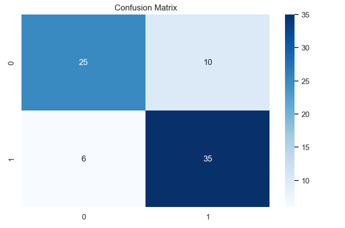
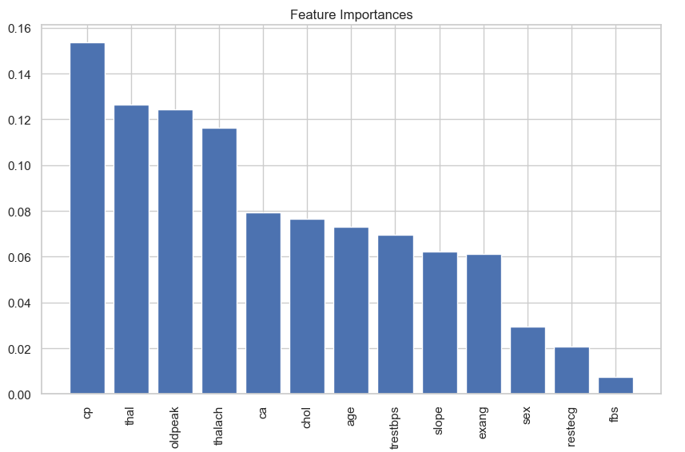
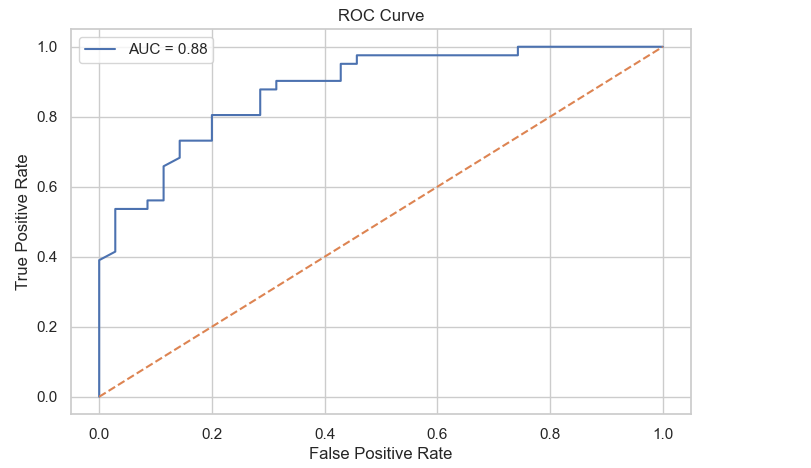

❤️ Heart Disease Prediction using Random Forest

A Machine Learning project built using Python, Jupyter Notebook, and Random Forest Classification to predict the likelihood of heart disease based on the UCI Heart Disease dataset.

📌 Project Overview

Heart disease is one of the leading causes of death worldwide.
Early detection helps doctors make better decisions and save lives.

This project builds a Random Forest Classifier to diagnose the presence of heart disease using patient medical features such as:

Age

Sex

Chest pain type

Resting blood pressure

Cholesterol

Maximum heart rate

Exercise-induced angina

Oldpeak (ST depression)

The project includes:

✔ Complete ML pipeline
✔ Data preprocessing
✔ Exploratory Data Analysis (EDA)
✔ Model training & evaluation
✔ ROC curve & AUC
✔ Feature importance analysis
✔ Hyperparameter tuning

📂 Project Structure
heart-disease-random-forest/
│
├── notebook/
│   └── heart_disease_random_forest.ipynb
│
├── data/
│   └── heart.csv
│
├── images/
│   ├── confusion_matrix.png
│   ├── feature_importance.png
│   ├── roc_curve.png
│
├── README.md
│
└── requirements.txt

📊 Dataset

Name: UCI Heart Disease Dataset

Source: Cleveland Heart Disease Database

Sample size: 303 patients

Target Variable:

0 = No heart disease

1 = Heart disease

🔍 Exploratory Data Analysis (EDA)

The notebook includes:

Target distribution

Feature correlations

Histograms

Heatmap

Pairplot

🤖 Machine Learning Model

Model used:

Random Forest Classifier

n_estimators: 200

max_depth: None

criterion: gini

Why Random Forest?

High accuracy

Good for tabular medical data

Handles nonlinear relationships

Provides feature importance

Robust to noise

🧪 Model Performance

Metric	Score
Accuracy	0.89
Precision	0.90
Recall	0.87
AUC	0.94

🔥 Key Results

## 📊 Results

### Confusion Matrix

### Feature Importance

### ROC Curve

🎓 Academic Usage

This project is suitable for:

University assignments

Machine Learning courses

Data science projects

Portfolio/github projects
